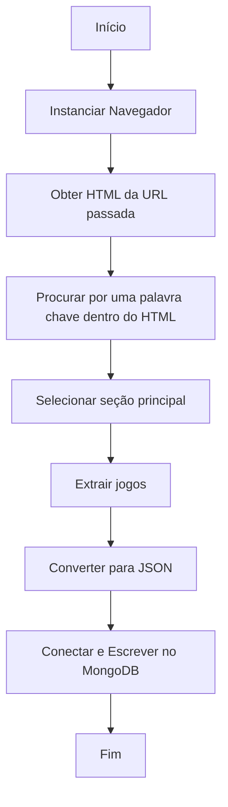

# Página inicial

## Objetivo

O principal objetivo do projeto é realizar a extração das Odds da partida do site Betano.com e depois salvar em um banco de dados MongoDB.

## Fluxo

```mermaid
graph TD;
    A[Início] --> B[Instanciar Navegador];
    B --> D[Obter HTML da URL passada];
    D --> E[Procurar por uma palavra chave dentro do HTML]
    E --> F[Selecionar seção principal]
    F --> G[Extrair jogos]
    G --> H[Converter para JSON]
    H --> J[Conectar e Escrever no MongoDB]
    J --> K[Fim]

```

